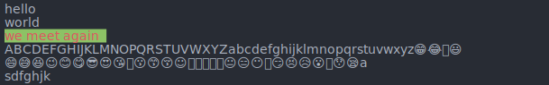
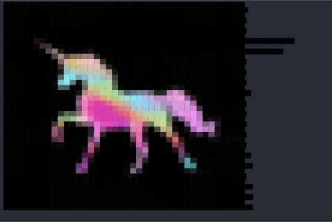
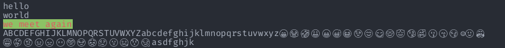
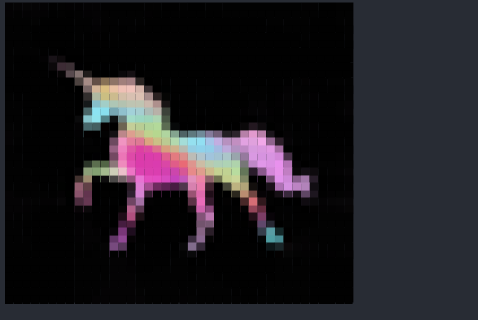
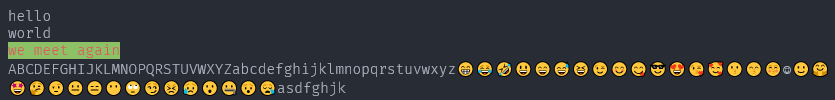
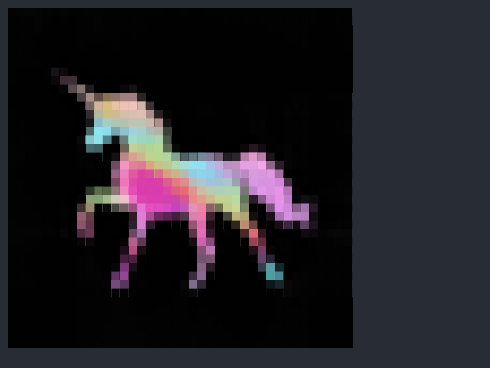
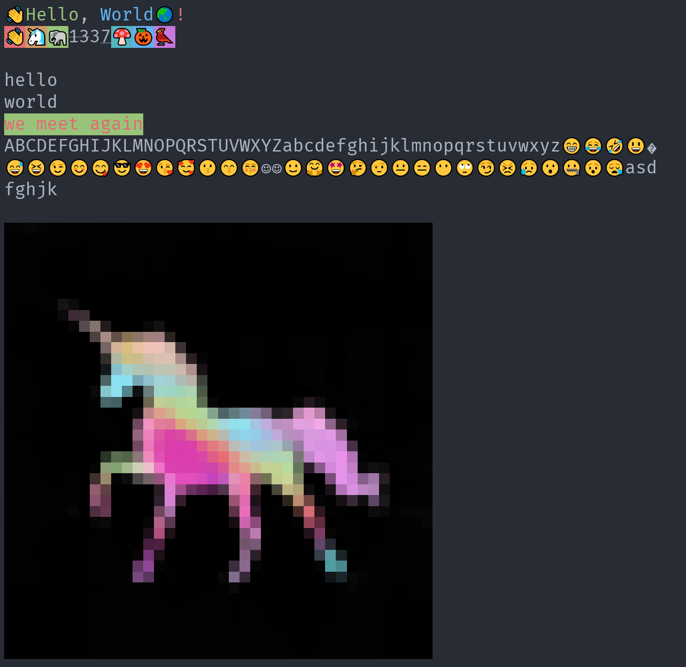

[](../../)
[](../../)
[](../../issues)
[](/LICENSE.md)
[](../../commits/master)
[](../../commits/master)
[](https://pypistats.org/packages/ansitoimg)
[](https://pepy.tech/project/AnsiToImg)
[](https://pypi.org/project/AnsiToImg)

<!-- omit in toc -->
# AnsiToImg


Convert an ANSI string to an image. Great for adding terminal output into a readme.

- [Examples](#examples)
	- [SVG Image](#svg-image)
	- [Raster Image](#raster-image)
	- [SVGRaster Image](#svgraster-image)
	- [HTML/ HTMLRaster Image](#html-htmlraster-image)
	- [Windows Terminal](#windows-terminal)
- [Choosing ansiToSVG, ansiToRaster, ansiToSVGRaster, ansiToHTML or ansiToHTMLRaster](#choosing-ansitosvg-ansitoraster-ansitosvgraster-ansitohtml-or-ansitohtmlraster)
	- [ansiToSVG](#ansitosvg)
	- [ansiToRaster](#ansitoraster)
	- [ansiToSVGRaster](#ansitosvgraster)
	- [ansiToHTML](#ansitohtml)
	- [ansiToHTMLRaster](#ansitohtmlraster)
- [Docs](#docs)
- [Install With PIP](#install-with-pip)
- [Language information](#language-information)
	- [Built for](#built-for)
- [Install Python on Windows](#install-python-on-windows)
	- [Chocolatey](#chocolatey)
	- [Download](#download)
- [Install Python on Linux](#install-python-on-linux)
	- [Apt](#apt)
- [How to run](#how-to-run)
	- [With VSCode](#with-vscode)
	- [From the Terminal](#from-the-terminal)
- [Download Project](#download-project)
	- [Clone](#clone)
		- [Using The Command Line](#using-the-command-line)
		- [Using GitHub Desktop](#using-github-desktop)
	- [Download Zip File](#download-zip-file)
- [Community Files](#community-files)
	- [Licence](#licence)
	- [Changelog](#changelog)
	- [Code of Conduct](#code-of-conduct)
	- [Contributing](#contributing)
	- [Security](#security)
	- [Support](#support)
	- [Rationale](#rationale)

## Examples

Here is an example of some code and the images it produces:

Functions accept the following arguments:
- ansiText - text to process
- fileName - name of the file to write to
- theme - a base24 theme. Defaults to atom one dark

```python
import sys
import os
from pathlib import Path
import platform
import ctypes
from catimage.catimage import generateHDColour

THISDIR = str(Path(__file__).resolve().parent)
sys.path.insert(0, os.path.dirname(THISDIR))
from ansitoimg.render import ansiToSVG, ansiToRaster, ansiToSVGRaster, ansiToHTML, ansiToHTMLRaster


if platform.system() == "Windows":
	kernel32 = ctypes.windll.kernel32
	kernel32.SetConsoleMode(kernel32.GetStdHandle(-11), 7)

# Define ANSI text
example = "👋\033[32mHello\033[0m, \033[34mWorld\033[0m🌏\033[31m!\033[0m\n\033[41m👋\033[0m\033[43m🦄\033[0m\033[42m🐘\033[0m\033[3m\033[9m13\033[0m\033[1m3\033[0m\033[4m7\033[0m\033[46m🍄\033[0m\033[44m🎃\033[0m\033[45m🐦\033[0m"
example2 = "hello\nworld\n\033[42m\033[31mwe meet again\033[0m\nABCDEFGHIJKLMNOPQRSTUVWXYZabcdefghijklmnopqrstuvwxyz😁😂🤣😃😄😅😆😉😊😋😎😍😘🥰😗😙😚☺🙂🤗🤩🤔🤨😐😑😶🙄😏😣😥😮🤐😯😪asdfghjk"
example3 = generateHDColour(THISDIR + "/test.png", 40)

# Print
print(example)
print()
print(example2)
print()
print(example3)
print()

# To SVG
ansiToSVG(example, THISDIR + "/example.svg")
ansiToSVG(example2, THISDIR + "/example2.svg")
ansiToSVG(example3, THISDIR + "/example3.svg")

# To Raster
ansiToRaster(example, THISDIR + "/example.png")
ansiToRaster(example2, THISDIR + "/example2.png")
ansiToRaster(example3, THISDIR + "/example3.png")

# To SVGRaster
ansiToSVGRaster(example, THISDIR + "/svgExample.png")
ansiToSVGRaster(example2, THISDIR + "/svgExample2.png")
ansiToSVGRaster(example3, THISDIR + "/svgExample3.png")

# To HTML
ansiToHTML(example, THISDIR + "/example.html")
ansiToHTML(example2, THISDIR + "/example2.html")
ansiToHTML(example3, THISDIR + "/example3.html")

# To HTMLRaster
ansiToHTMLRaster(example, THISDIR + "/htmlExample.png")
ansiToHTMLRaster(example2, THISDIR + "/htmlExample2.png")
ansiToHTMLRaster(example3, THISDIR + "/htmlExample3.png")
```

### SVG Image






### Raster Image





### SVGRaster Image




### HTML/ HTMLRaster Image







### Windows Terminal



## Choosing ansiToSVG, ansiToRaster, ansiToSVGRaster, ansiToHTML or ansiToHTMLRaster

### ansiToSVG
This is better for the vast majority of cases as the image sizes are smaller
for reasonably simple ANSI sequences. The image size scales proportionally
with the length of the ANSI sequence. A large number of applications tend to
opt for shorter sequences for output making `ansiToSVG` the better option.
`ansiToSVG` also handles emoji as well as the OS does. For instance, on Windows
10 one can expect full colour emoji. Image sizes can get out of hand for some
cases such as catimage output as those tend to be very long ANSI sequences.

### ansiToRaster
The image size does not scale to the length of the ANSI sequence but does scale
to the number of lines of terminal output. This is ideal for output of complex
ANSI sequences that would be huge if `ansiToSVG` were used. However, emojis are
in black and white and show quite poorly on coloured backgrounds.

### ansiToSVGRaster
Takes the advantages that `ansiToRaster` has whilst keeping colour emojis, Yay!
This uses pyppeteer to fire up a headless browser which opens the SVG and takes
a screenshot.

### ansiToHTML
Has the same advantages and disadvantages of `ansiToSVG` though this is not
suitable to be included in a GitHub readme

### ansiToHTMLRaster
Has the same advantages and disadvantages of `ansiToSVGRaster`


## Docs
See the [Docs](/DOCS/README.md) for more information.


## Install With PIP

```python
pip install ansitoimg
```

Head to https://pypi.org/project/ansitoimg/ for more info


## Language information
### Built for
This program has been written for Python 3 and has been tested with
Python version 3.9.0 <https://www.python.org/downloads/release/python-380/>.

## Install Python on Windows
### Chocolatey
```powershell
choco install python
```
### Download
To install Python, go to <https://www.python.org/> and download the latest
version.

## Install Python on Linux
### Apt
```bash
sudo apt install python3.9
```

## How to run
### With VSCode
1. Open the .py file in vscode
2. Ensure a python 3.9 interpreter is selected (Ctrl+Shift+P > Python:Select
Interpreter > Python 3.9)
3. Run by pressing Ctrl+F5 (if you are prompted to install any modules, accept)
### From the Terminal
```bash
./[file].py
```


## Download Project
### Clone
#### Using The Command Line
1. Press the Clone or download button in the top right
2. Copy the URL (link)
3. Open the command line and change directory to where you wish to
clone to
4. Type 'git clone' followed by URL in step 2
```bash
$ git clone https://github.com/FHPythonUtils/AnsiToImg
```

More information can be found at
<https://help.github.com/en/articles/cloning-a-repository>

#### Using GitHub Desktop
1. Press the Clone or download button in the top right
2. Click open in desktop
3. Choose the path for where you want and click Clone

More information can be found at
<https://help.github.com/en/desktop/contributing-to-projects/cloning-a-repository-from-github-to-github-desktop>

### Download Zip File

1. Download this GitHub repository
2. Extract the zip archive
3. Copy/ move to the desired location

## Community Files
### Licence
MIT License
Copyright (c) FredHappyface
(See the [LICENSE](/LICENSE.md) for more information.)

### Changelog
See the [Changelog](/CHANGELOG.md) for more information.

### Code of Conduct
Online communities include people from many backgrounds. The *Project*
contributors are committed to providing a friendly, safe and welcoming
environment for all. Please see the
[Code of Conduct](https://github.com/FHPythonUtils/.github/blob/master/CODE_OF_CONDUCT.md)
 for more information.

### Contributing
Contributions are welcome, please see the
[Contributing Guidelines](https://github.com/FHPythonUtils/.github/blob/master/CONTRIBUTING.md)
for more information.

### Security
Thank you for improving the security of the project, please see the
[Security Policy](https://github.com/FHPythonUtils/.github/blob/master/SECURITY.md)
for more information.

### Support
Thank you for using this project, I hope it is of use to you. Please be aware that
those involved with the project often do so for fun along with other commitments
(such as work, family, etc). Please see the
[Support Policy](https://github.com/FHPythonUtils/.github/blob/master/SUPPORT.md)
for more information.

### Rationale
The rationale acts as a guide to various processes regarding projects such as
the versioning scheme and the programming styles used. Please see the
[Rationale](https://github.com/FHPythonUtils/.github/blob/master/RATIONALE.md)
for more information.
