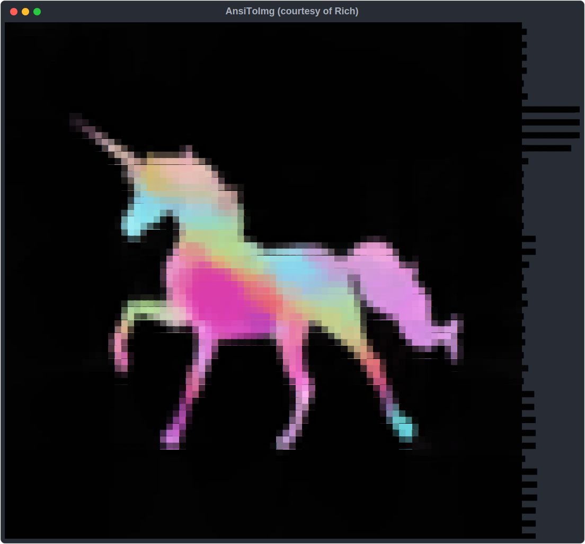

# Tutorial

- [Tutorial](#tutorial)
	- [Overview](#overview)
		- [Example Program](#example-program)
			- [Source](#source)
			- [Output](#output)
				- [SVG Image](#svg-image)
				- [Render Image](#render-image)
				- [SVGRender Image](#svgrender-image)
				- [HTML/ HTMLRender Image](#html-htmlrender-image)
	- [Choosing ansiToSVG, ansiToRender, ansiToSVGRender, ansiToHTML or ansiToHTMLRender](#choosing-ansitosvg-ansitorender-ansitosvgrender-ansitohtml-or-ansitohtmlrender)
		- [ansiToSVG](#ansitosvg)
		- [ansiToRender](#ansitorender)
		- [ansiToSVGRender](#ansitosvgrender)
		- [ansiToHTML](#ansitohtml)
		- [ansiToHTMLRender](#ansitohtmlrender)

## Overview

Here is some code and the images it produces:

Functions accept the following arguments:

- ansiText - text to process
- fileName - name of the file to write to
- theme - a base24 theme. Defaults to atom one dark

### Example Program

#### Source

```python
import sys
from pathlib import Path

oldStdout = sys.stdout

THISDIR = str(Path(__file__).resolve().parent)
sys.path.insert(0, str(Path(THISDIR).parent))
from ansitoimg.render import (
	ansiToHTML,
	ansiToHTMLRender,
	ansiToRender,
	ansiToSVG,
	ansiToSVGRender,
)

# Define ANSI text
fancyHelloWorld = (
	"👋\033[32mHello\033[0m, \033[34mWorld\033[0m🌏\033[31m!\033[0m\n\033[41m"
	"👋\033[0m\033[43m🦄\033[0m\033[42m🐘\033[0m\033[3m\033[9m13\033[0m\033[1m3"
	"\033[0m\033[4m7\033[0m\033[46m🍄\033[0m\033[44m🎃\033[0m\033[45m🐦\033[0m"
)
fredHappyfaceHD = Path(f"{THISDIR}/data/fredHappyfaceHD.txt").read_text(encoding="utf-8")
metprintOutput = Path(f"{THISDIR}/data/metprintOutput.txt").read_text(encoding="utf-8")
sys.stdout = oldStdout

# Print
print(fancyHelloWorld)
print()
print(fredHappyfaceHD)
print()
print(metprintOutput)
print()

# To SVG
ansiToSVG(fancyHelloWorld, f"{THISDIR}/data/fancyHelloWorld.svg", wide=False)
ansiToSVG(fredHappyfaceHD, f"{THISDIR}/data/fredHappyfaceHD.svg")
ansiToSVG(metprintOutput, f"{THISDIR}/data/metprintOutput.svg", wide=False)

# To Render
ansiToRender(fancyHelloWorld, f"{THISDIR}/data/fancyHelloWorld.png", wide=False)
ansiToRender(fredHappyfaceHD, f"{THISDIR}/data/fredHappyfaceHD.png")
ansiToRender(metprintOutput, f"{THISDIR}/data/metprintOutput.png", wide=False)

# To SVGRender
ansiToSVGRender(fancyHelloWorld, f"{THISDIR}/data/fancyHelloWorld.svg.png", wide=False)
ansiToSVGRender(fredHappyfaceHD, f"{THISDIR}/data/fredHappyfaceHD.svg.png")
ansiToSVGRender(metprintOutput, f"{THISDIR}/data/metprintOutput.svg.png", wide=False)

# To HTML
ansiToHTML(fancyHelloWorld, f"{THISDIR}/data/fancyHelloWorld.html", wide=False)
ansiToHTML(fredHappyfaceHD, f"{THISDIR}/data/fredHappyfaceHD.html")
ansiToHTML(metprintOutput, f"{THISDIR}/data/metprintOutput.html", wide=False)

# To HTMLRender
ansiToHTMLRender(fancyHelloWorld, f"{THISDIR}/data/fancyHelloWorld.html.png", wide=False)
ansiToHTMLRender(fredHappyfaceHD, f"{THISDIR}/data/fredHappyfaceHD.html.png")
ansiToHTMLRender(metprintOutput, f"{THISDIR}/data/metprintOutput.html.png", wide=False)

```

#### Output

##### SVG Image





##### Render Image


##### SVGRender Image


##### HTML/ HTMLRender Image


## Choosing ansiToSVG, ansiToRender, ansiToSVGRender, ansiToHTML or ansiToHTMLRender

### ansiToSVG

This is better for the vast majority of cases as the image sizes are smaller
for reasonably simple ANSI sequences. The image size scales proportionally
with the length of the ANSI sequence. A large number of applications tend to
opt for shorter sequences for output making `ansiToSVG` the better option.
`ansiToSVG` also handles emoji as well as the OS does. For instance, on Windows
10 one can expect full colour emoji. Image sizes can get out of hand for some
cases such as catimage output as those tend to be very long ANSI sequences.

### ansiToRender

The image size does not scale to the length of the ANSI sequence but does scale
to the number of lines of terminal output. This is ideal for output of complex
ANSI sequences that would be huge if `ansiToSVG` were used. However, emojis are
in black and white and show quite poorly on coloured backgrounds.

### ansiToSVGRender

Takes the advantages that `ansiToRender` has whilst keeping colour emojis, Yay!
This uses pyppeteer to fire up a headless browser which opens the SVG and takes
a screenshot.

### ansiToHTML

Has the same advantages and disadvantages of `ansiToSVG` though this is not
suitable to be included in a GitHub readme

### ansiToHTMLRender

Has the same advantages and disadvantages of `ansiToSVGRender`
