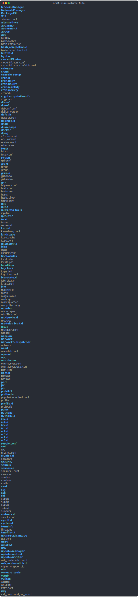

<!-- omit in toc -->
# Command Line Tutorial

- [Overview](#overview)
- [Example](#example)

## Overview


```bash
ansitoimg --help
usage: ansitoimg [-h] [--plugin PLUGIN] [--theme THEME] [--wide] [--width WIDTH]
                 [input] output

Convert an ANSI string to an image. Great for adding terminal output into a readme.

positional arguments:
  input                 Filename to read from
  output                Filename to write to

options:
  -h, --help            show this help message and exit
  --plugin PLUGIN, -p PLUGIN
                        Plugin to use. One of svg, render, svgrender, html, htmlrender,
                        default=svg
  --theme THEME, -t THEME
                        Enter the path to a base24 theme
  --wide, -w            Use a 'wide' virtual terminal (89 chars vs 49)
  --width WIDTH         Explicitly set the width in chars
```

## Example


1. Install ansitoimg
	```bash
	$ pipx install ansitoimg
	installed package ansitoimg 2023.1, installed using Python 3.8.10
	These apps are now globally available
		- ansitoimg
	done! ✨ 🌟 ✨
	```

2. Using ls with ansitoimg (piped)
   ```bash
   ls --color=always /etc | ansitoimg ls.svg
   ```
   
